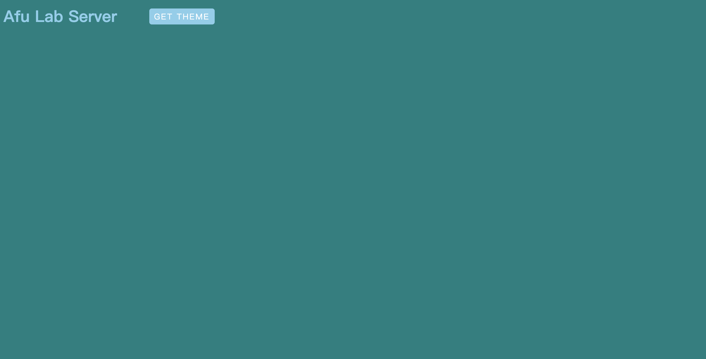

# afu.lab.server


## Introduction
基於 [Koa](https://koa.bootcss.com/) & [go-task](https://taskfile.dev/)
建構的 `Server`，目的是來做假資料給前端做測試

## Install
1. Install [node.Js](https://nodejs.org/en/)

2. Install [yarn](https://yarnpkg.com/)
   
   ```bash
   npm install -g yarn 
   ```
3. Install [go-task](https://taskfile.dev/)

    ```bash
    # macOS
    brew install go-task/tap/go-task
    ```
4. run `task`
   
    ```bash
        task
    ```
